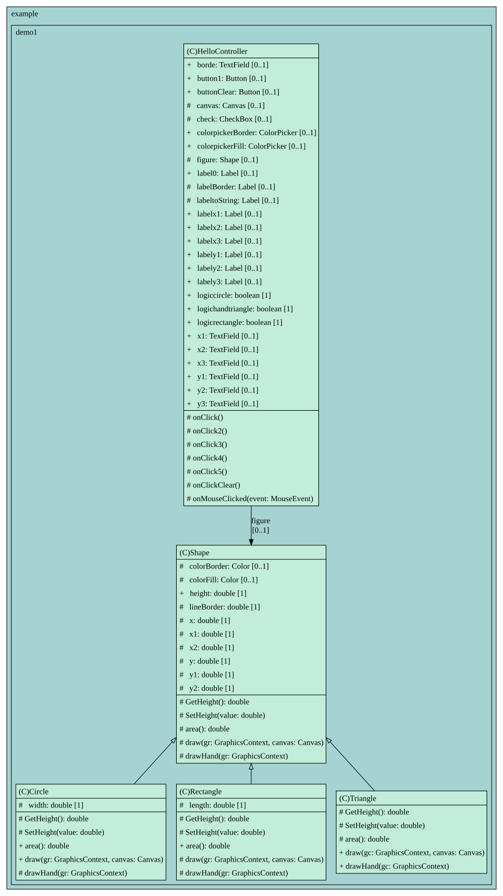

# Task 1 - Абстрактный суперкласс

## Условие задачи
__Разрабатывается система автоматизированного проектирования__. Базовым типом каждой  для каждой детали или строительной конструкции является __«форма»__, и каждая форма имеет цвет, размер, идентификатор и другие характеристики. Все наследуемые конкретные типы фигур - __блок__, __кирпич__, __стена__ и прочие., могут иметь дополнительные характеристики и поведение. Их характеристики могут дополняться, а  поведение может отличаться, например, _формула вычисления площади_ поверхности каждой конкретной  фигуры, ее _отображение_ - различно. Иерархия типов воплощает в себе как сходства, так и различия между формами.

## Диаграмма UML
> [!NOTE]
> Диаграмма классов `models`:

